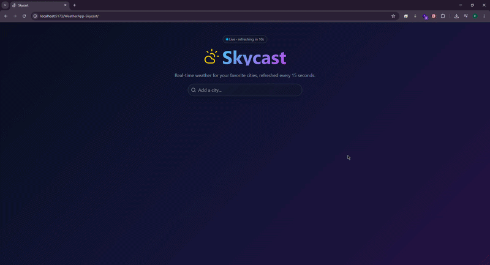
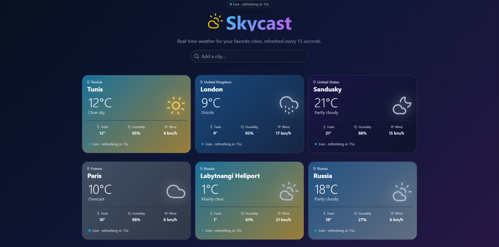
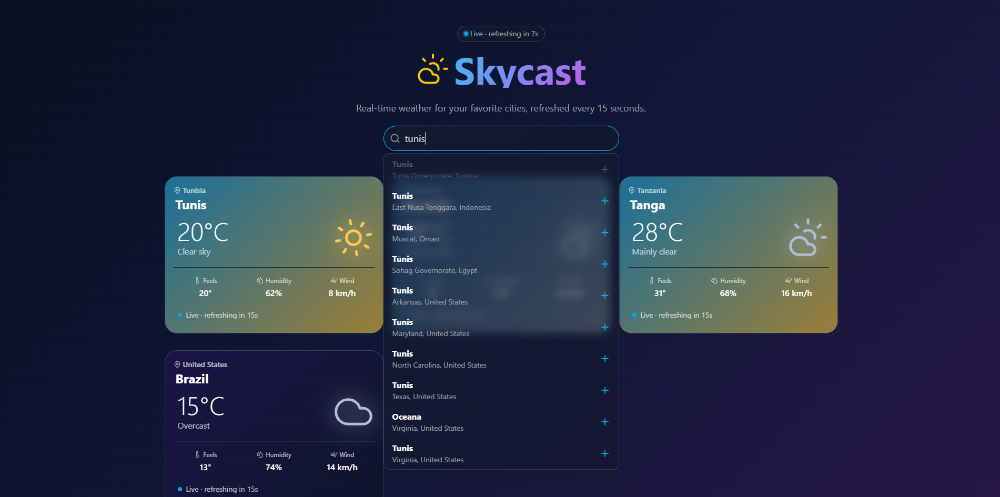
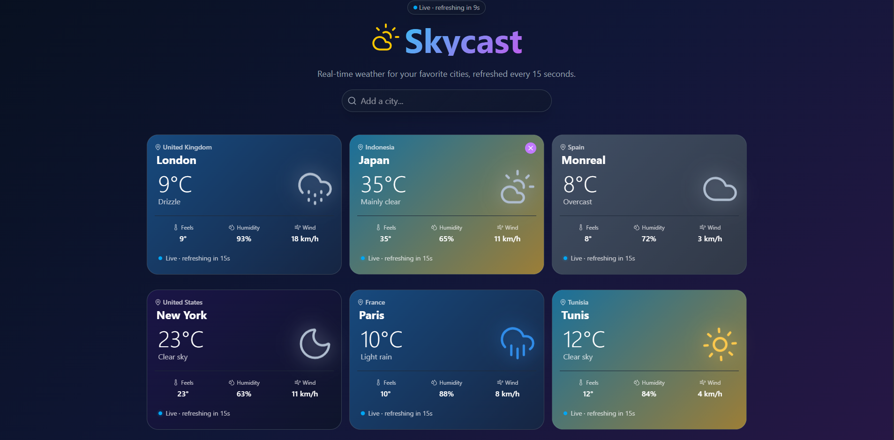
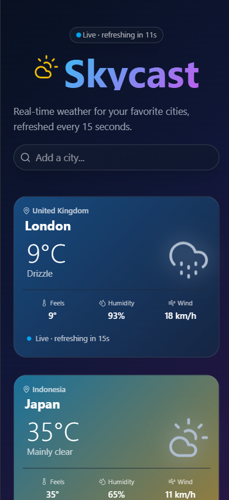

# Skycast Weather App


A modern and responsive weather application built with **React.js**, **TypeScript**, **Vite**, and **Tailwind CSS**.

The app allows users to search for cities, add them to a weather dashboard, and view real-time weather information such as temperature, humidity, wind speed, apparent temperature, and weather conditions. Weather data is fetched from the **Open-Meteo API** and automatically refreshed every **15 seconds**.

---

## Live Demo

[View Live Project](https://nizarchaouch.github.io/WeatherApp-Skycast/)

---

## Demo



---

## Screenshots

### Home Page



### Search City



### Weather Cards



### Responsive View



---

## Features

- Search for cities using the Open-Meteo Geocoding API
- Add multiple cities to the weather dashboard
- Prevent duplicate cities from being added
- Display real-time weather data for each city
- Show temperature, apparent temperature, humidity, and wind speed
- Display weather condition icons based on weather codes
- Dynamic card backgrounds depending on the weather condition and day/night status
- Remove cities from the dashboard
- Auto-refresh weather data every 15 seconds
- Debounced city search to reduce unnecessary API requests
- Responsive layout for desktop, tablet, and mobile screens
- Clean and modern UI with animated icons

---

## Technologies Used

- React.js
- TypeScript
- Vite
- Tailwind CSS
- Open-Meteo Weather API
- Open-Meteo Geocoding API
- Lucide React Icons
- ESLint
- Git & GitHub
- GitHub Pages

---

## APIs Used

This project uses free APIs from **Open-Meteo**:

- City search: `https://geocoding-api.open-meteo.com/v1/search`
- Current weather: `https://api.open-meteo.com/v1/forecast`

---

## Installation

Clone the repository:

```bash
git clone https://github.com/nizarchaouch/WeatherApp-Skycast
```

Go to the project folder:

```bash
cd weather-app
```

Install dependencies:

```bash
npm install
```

Run the development server:

```bash
npm run dev
```

Build the project for production:

```bash
npm run build
```

---

## Project Structure

```bash
weather-app/
├── public/
├── src/
│   ├── assets/
│   │   ├── logo.svg
│   │   └── screenshots/
│   │       ├── demo.gif
│   │       ├── home.png
│   │       ├── search-city.png
│   │       ├── weather-cards.png
│   │       └── responsive.png
│   ├── components/
│   │   ├── Header.tsx
│   │   ├── SearchCity.tsx
│   │   ├── Status.tsx
│   │   └── WeatherCard.tsx
│   ├── types/
│   │   ├── CityData.ts
│   │   └── weatherData.ts
│   ├── utlis/
│   │   ├── getWeatherCodeIcon.tsx
│   │   └── weatherGradient.ts
│   ├── App.tsx
│   ├── main.tsx
│   └── index.css
├── package.json
├── vite.config.ts
├── tsconfig.json
└── README.md
```

---

## Author

**Nizar Chaouch**
